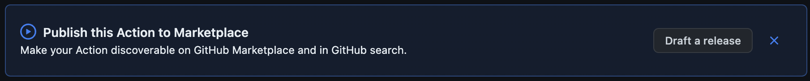

# How to write GitHub custom action.

* In this repo we will see how to write a custom javascript github action. There are other type of actions as well but we won't cover them in this repo. If you want to lean them you can see the github actions documentation [here](https://docs.github.com/en/actions/creating-actions)
* Creating an action metadata file i.e. action.yaml file
* Provide metadeta in this file for reference see the [action.yml](https://github.com/mobilelive-inc/github-actions-mvp/blob/main/action.yml) file.

* Install the following packages using command.
```
npm install @actions/core @actions/github
```
* Write the action code in index.js file for reference see the [index.js](https://github.com/mobilelive-inc/github-actions-mvp/blob/main/index.js) file.

# How to publish GitHub action.

* To publish your github action make sure your repository is public and have action.yaml file in it.
* After pushing your code to github you will see the following button on the top of your repo code.

* Click draft a release button to make a new release and publish it to the github action marketplace.

# How to use GitHub action.

* You can use any public action from the github action marketplace.
* For reference see this file [hello-world.yaml](https://github.com/mobilelive-inc/github-actions-mvp/blob/main/.github/workflows/hello-world.yaml)
